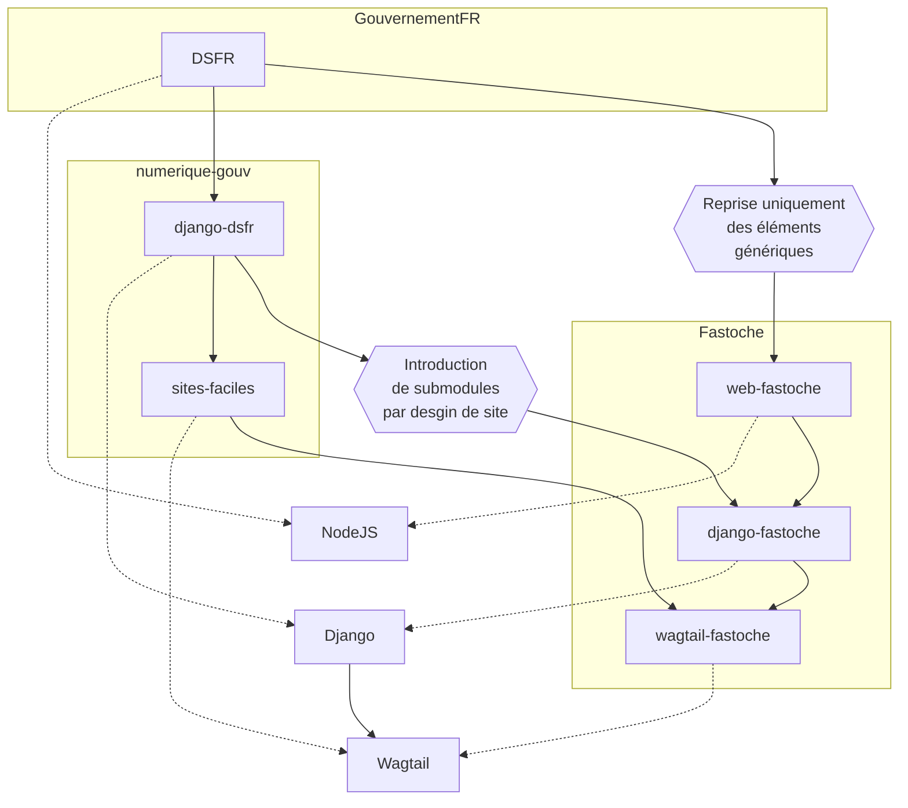

# Gestionnaire de contenu Fastoche

Sur la base de sites-facile de la DINUM, France, Fastoche.org propose de capitaliser sur le travail de fond pour le traitement d'information et de la communication en rendant les composants génériques. 

Voici un autre diagramme autour de l'idée de faire un outil publiquement utilisable Wagtail-SiFacile.





Voici des notes aléatoires:

```sql
CREATE DATABASE "wagtailfastoche" WITH OWNER "wagtailfastoche" ENCODING 'UTF8';
ALTER database wagtailfastoche owner to wagtailfastoche;
GRANT ALL privileges ON DATABASE wagtailfastoche TO wagtailfastoche;
```

```bash
git clone git@github.com:chris2fr/wagtail-fastoche.git
python -m venv venv
source venv/bin/activate
pip install pre-commit django
cp .env.example .env
vi .env
pre-commit install
pre-commit run --all-files
make init
make collectstatic
poetry run python manage.py createsuperuser
```

```
SECRET_KEY=<VALUE>
DEBUG=False
HOST_PROTO=http
# HOST_URL and ALLOWED_HOSTS: use 0.0.0.0 for Docker
HOST_URL=0.0.0.0
ALLOWED_HOSTS=localhost, 127.0.0.1, wagtail.fastoche.org
HOST_PORT=8890
SITE_NAME=Wagtail Fastoche
MEDIA_ROOT=medias


```

## Texte reproduite de la DINUM

**Créez et gérez votre site internet simplement**

Gestionnaire de contenu (CMS) pour créer un site internet dont le domaine se terminant par .gouv.fr . Pas besoin de compétence technique pour mettre à jours le contenu.

**Un CMS basé sur la solution open source Wagtail**

Créez ou modifiez des pages, ajoutez un menu de navigation, des boutons, images, vidéos, contributeurs etc

**Système de Design de l'État**

Construisez vos pages à l'aide de composants prêts à l'emploi issus du Système de Design de l'État (DSFR)

**Accessible et responsive**

Le contenu des pages générées par le CMS est partiellement conforme selon la norme RGAA 4.1 et responsive

## Prérequis

- Python 3.10
- Postgreql 14.x.

## Installer les pre-commit hooks

```
pre-commit install
```

On peut faire un premier test en faisant tourner :

```
pre-commit run --all-files
```

## Installation

Le projet peut se lancer en local ou avec Docker.

### Dans tous les cas, copier les variables d’environnement

- Copier le fichier
```
cp .env.example .env
```

- Générer la `SECRET_KEY`
```
python -c "from django.core.management.utils import get_random_secret_key; print(get_random_secret_key())"
```

- Mettre les valeurs pertinentes dans le fichier `.env`

### En local
#### Installer poetry s’il ne l’est pas

Cf. la [documentation de poetry](https://python-poetry.org/docs/#installation)

#### Installer le projet

- La commande suivante installe les dépendances, fait les migrations et collecte les fichiers
```
make init
```

#### Créer un utilisateur

- La commande suivante crée un utilisateur administrateur avec tous les droits:

```
poetry run python manage.py createsuperuser
```

#### Lancer le serveur

```
make runserver
```

### via Docker
#### Lancer les containers

```sh
docker compose up
```

### Effectuer les tests
Les tests unitaires peuvent être lancés avec `make test-unit`.

Vous pouvez également générer un rapport sur la couverture de tests :
```sh
coverage run manage.py test --settings wagtail_fastoche.config.settings_test
```

## Indexation des contenus
Les contenus des pages sont indexés pour la recherche par un script `python manage.py update_index` (cf. [documentation de Wagtail](https://docs.wagtail.org/en/stable/topics/search/indexing.html))

### Scalingo
Le script est lancé automatiquement après les déploiements sur Scalingo.

Il est recommandé de procéder à une nouvelle indexation une fois par semaine, en renommant le fichier `cron.json.example` en `cron.json` (cf. [documentation de Scalingo](https://doc.scalingo.com/platform/app/task-scheduling/scalingo-scheduler))

### Autres déploiements
Il est recommandé de faire de même pour les déploiements sur d’autres plateformes, en ajoutant une ligne à la crontab de l’utilisateur avec lequel tourne le site :

```
0 3 * * SUN python manage.py update_index
```
